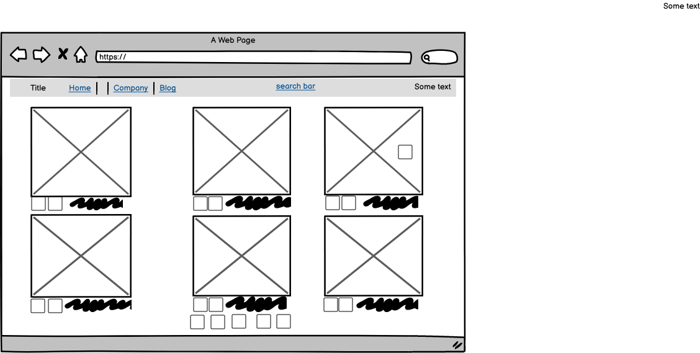
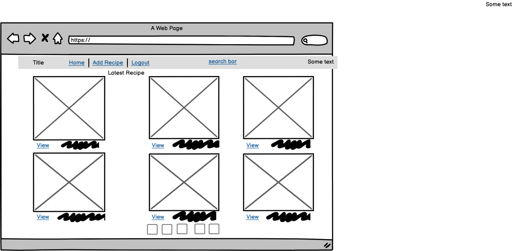
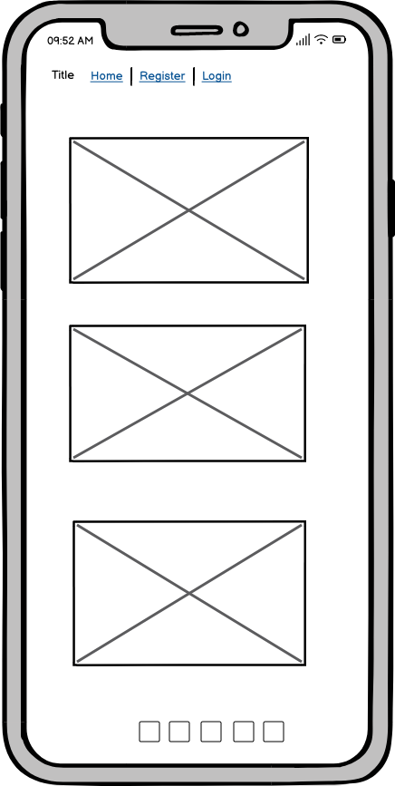

# [WELCOME TO HEALTHY RECIPES SITE](https://8000-snezhanazdravkova-recipe-0xcekgdfdb.us2.codeanyapp.com/)

[Heroku git URL:](https://git.heroku.com/recipes-book2022.git)

[Git Hub Repository:](https://github.com/SnezhanaZdravkova/RecipesBook)

This is a full-stack framework project built using Django, Python, HTML and CSS. My goal is to create a functioning and responsive website, that allows users:
- to be able to registers, log in and logout,
- to be able to see all the recipes, create recipes, update recipes and delete recipe,
- to be able to leave a comment and edit comment recipes.

This project has been built for educational purposes.

## User Experience

A visitor to Healthy Recipes would be someone who is most likely an adult who enjoys their food and trying new recipes but also wants to save time and effort when deciding what to cook every day of the week.

## User Stories

### User Profile
- As a Site User, I can register an account so that I can add/edit/delete my recipes and comment on recipes.
- As a Site User, I can log in or log out of my account so that I can keep my account secure.
- As a Site User, I can see my login status so that I know if I'm logged in or out.

### Login/Register
- As a Site User, I can register for an account so that I can interact with the site content
- As a Site User, I can log in/out off my account if I wish so that I can connect or disconnect from the website
- As a Site User, I can easily see if I'm logged-in or logged-out so that I can be sure what my status is
- As a Site User, I can click on a recipe so that I can read the full recipe, ingredients required and view comments left by users.
- As a Site User, I can view my recipes so that I can see and manage all recipes I have created in the one location

### Site Administration
- As a Site Administrator, I can create, read, update and delete recipes and comments so that I can manage the app content.

## Data Model
I used principles of Object-Oriented Programming throughout this project and Django’s Class-Based Generic Views.

Django AllAuth was used for the user authentication system.
In order for the users to create recipes a custom recipe model was required. The recipe author is a foreign key to the User model given a recipe can only have one author.
The Comment model allows users to comment on individual recipes and the Recipe is a foreign key in the comment model given a comment can only be linked to one recipe.

The diagram below details the database schema: (the file couldn't load. Codeanywhere wouldn't accsept files bigge than 1 mb, sorry)
 

# Security Features and Defensive Design

## User Authentication

Django's LoginRequiredMixin have been used to make sure that any requests to access secure pages by non-authenticated users / Authors are redirected. Django's UserPassesTestMixin have been used to limit access based on permissions. Eg: To ensure users can only Update / Delete Recipes or Comments for which they are the User / Author.

If the User /Author doesn't pass the test they are shown to the 403 Forbidden Error.

## Form Validation

If incorrect or empty information / data is added to a From, the Form won't submit and a warning will appear to the User / Author informing them what field raised the error

## Database Security

> The Database URL and secret key are stored in the env.py file to prevent unwanted connections to the 
> Database and this was done at the beginning of the App set up and pushed to GitHub.

> Cross-Site Request Forgery (CSRF) Tokens are used on all Forms within the App.

## Balsamiq Wireframes

Wireframes are extremely basic and did not incorporate all App pages. Wireframes were used as boiler plates to start the app design many updates and alterations made after the basic Wireframes were used to get started on the App.

Balsamiq Wireframes:
- 
- 
- 

## User Story Testing
### Testing Users Stories form (UX) Section
> Superuser / Admin
- As a site Admin I can create, edit and delete recipes and comments so that I can manage the site content
- As a site Admin I can access the admin panel so that I can manage recipes and comments
- As a site Admin I can log out of the admin panel so that I can disconnect from the website

This was tested by accessing the Django Admin Panel. By creating a Superuser we can access the Django Admin Panel where the administrator can perform all the CRUD functionalitis

> User Interaction
- As a logged-in User I can write comments on recipes so that I can leave my feedback
- As a User I can view the number of likes on recipes so that I can see which recipes are the most popular
- As a User I can view comments on recipes so that I can read other users opinions

> User Recipes
- As a logged-in User I can post a recipes so that other users can see them

> Login/Register
- As a User I can register for an account so that I can interact with the site content
- As a User I can log in/out off my account if I wish so that I can connect or disconnect from the website
- As a User I can easily see if I'm logged-in or logged-out so that I can be sure what my status is

> Navigation
- As a User I can easily navigate through the site so that I can view desired content
- As a User I can see the most loved recipes so that I can quickly find inspiration and see which recipes are most famous

## Bugs and Issues
- I had a problem with submiting create_recipe ("IntegrityError at /create_recipe/
duplicate key value violates unique constraint "recipes_recipes_slug_key"
DETAIL:  Key (slug)=() already exists.") - the problem was with slug. The issue was fix with slugify:
(image to be added)
- likes not working - not fixt issue
- comments can't be delete (didn't finish code)

## Future Features
- To have Search bar
- to have obtion for Users to share recipes
- to add Categories for the recipes

# Deployment - Heroku

This project was deployed using Github, Heroku and ElephentSQL.

## Github
To create a new repository I took the following steps:

- Logged into Github.
- Clicked over to the ‘repositories’ section.
- Clicked the green ‘new’ button. This takes you to the create new repository page.
- Once there under ‘repository template’ I chose the code institute template from the dropdown menu.
- I input a repository name then clicked the green ‘create repository button’ at the bottom of the page.
- Once created I opened the new repository and clicked the green ‘Gitpod’ button to create a workspace in Gitpod for editing.

## Create the Heroku App:
- Log in to Heroku or create an account.
- On the main page click the button labelled New in the top right corner and from the drop-down menu select "Create New App".
- Enter a unique and meaningful app name.
- Next select your region.
- Click on the Create App button.

## Attach the ElephentSQL database:
- 
- Copy the DATABASE_URL located in Config Vars in the Settings Tab.

## Prepare the environment and settings.py file:
- In your GitPod workspace, create an env.py file in the main directory.
- Add the DATABASE_URL value and your chosen SECRET_KEY value to the env.py file.
- Update the settings.py file to import the env.py file and add the SECRETKEY and DATABASE_URL file paths.
- Comment out the default database configuration.
- Save files and make migrations.
- Add Cloudinary URL to env.py
- Add the cloudinary libraries to the list of installed apps.
- Add the STATIC files settings - the url, storage path, directory path, root path, media url and default file storage path
- Link the file to the templates directory in Heroku
- Change the templates directory to TEMPLATES_DIR
- Add Heroku to the ALLOWED_HOSTS list the format ['app_name.heroku.com', 'localhost']

## Create files / directories
- Create requirements.txt file
- Create three directories in the main directory; media, storage and templates.
- Create a file named "Procfile" in the main directory and add the following: web: gunicorn project-name.wsgi

## Update Heroku Config Vars
Add the following Config Vars in Heroku:
- SECRET_KEY value
- CLOUDINARY_URL
- PORT = 8000
- DISABLE_COLLECTSTATIC = 1

## Deploy
- NB: Ensure in Django settings, DEBUG is False
- Go to the deploy tab on Heroku and connect to GitHub, then to the required repository.
- Scroll to the bottom of the deploy page and either click Enable Automatic Deploys for automatic deploys or Deploy Branch to deploy manually. Manually deployed branches will need re-deploying each time the repo is updated.
- Click View to view the deployed site.

The site is now live and operational.

## Clone Project

>> Cloning of Project was made possible by GitHub

- Go to Git Hub
- Go to the repository
- Click on it to go to main repository site
- Click on the Code drop down button menu next to the greeen Gippod button
- Click on HTTP section you will see the http of the repository click on the window next to it it will say copied
- Clikced on Download and Zip
- Clicked on Open with GitHubDesktop

## Languages
- HTML
- CSS
- PYTHON
- JavaScript

## Frameworks - Libraries - Programs Used
- Django: Main python framework used in the development of this project
- Django-allauth: authentication library used to create the user accounts
- ElephentSQL was used as the database for this project
- Heroku - was used as the cloud based platform to deploy the site on
- Chrome Dev Tools - Used for overall development and tweaking, including testing responsiveness and performance
- Font Awesome - Used for icons
- GitHub - Used for version control and agile tool
- Google Fonts - Used to import and alter fonts on the page
- W3C - Used for HTML & CSS Validation
- PEP8 Online - used to validate all the Python code
- Crispy Forms used to manage Django Forms
- Cloudinary: the image hosting service used to upload images
- Bootstrap 4: CSS Framework for developing responsiveness and styling

## Credits
- Code Institute - 'I think therefore I blog' project helped me with recipe details page and pagination
- Summernote
- Django documentation - also helped me with pagination and other problems
- To get the Django framework installed and set up I followed the Code institutes Django Blog cheatsheet
- W3Schools
- Django Docs
- Stack Overflow
- Bootstrap
- Balsamic

## Acknowledgements
- Many thanks to my mentor Ronan for his support and advice and for helping me to fix slud problem.
- Thanks to The Code Institute slack community
- Thanks to my colleague Tara Helberg for helping and inspiring
- Thanks AliOKeeffe for helping me with my README.MD file
